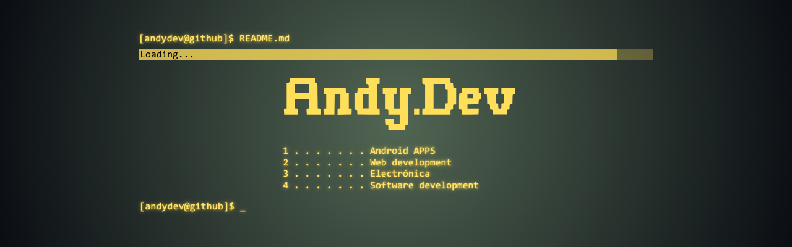

# 👋 Hi, I'm Andrés

Backend Developer | Electronician | Systems-Oriented Thinker

---

## 🧠 About Me

I’m a Computer Science student focused on building efficient backend systems and exploring artificial intelligence.

I’m particularly interested in:
- Secure and scalable backend architectures
- Machine Learning fundamentals
- Clean code and system design
- Privacy-focused software engineering

---

## 🛠 Tech Stack

### Languages

### Databases

### Tools

---

## 📊 GitHub Stats

---

## 📫 Connect with Me

